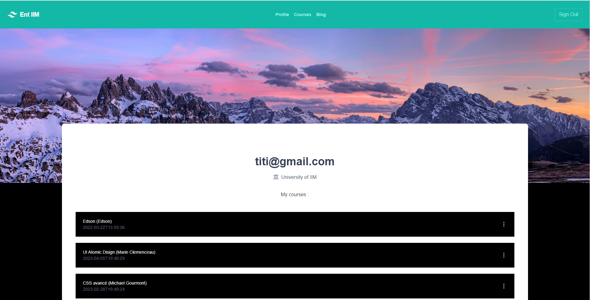
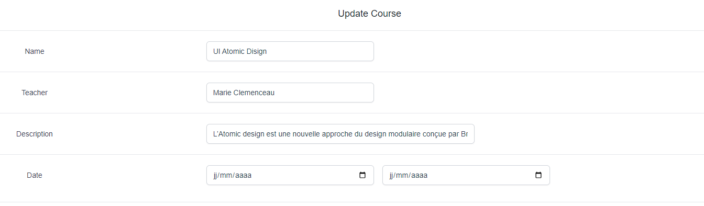

Vue.js + SupaBase 
=== 


Simple web page where the student can register / connect, and see the classes that are assigned to him. It is based on [Vue.js](https://vuejs.org/) technologies for the front and backend [SupaBase](https://app.supabase.com/)
.And a teacher side where we can add courses

## Preview 
####User profile :

####Update coursess :

## Prerequisites
You will need [Node.js](https://nodejs.org) version 6.0 or greater installed on your system.

## Setup

Get the code by either cloning this repository using git

    > git clone https://github.com/edsonDeCavalho/vuejs-SupaBase-studentSchedule

... or [downloading source code](https://github.com/edsonDeCavalho/vuejs-SupaBase-studentSchedule/archive/main.zip) code as a zip archive.

Once downloaded, open the terminal in the project directory, and continue with:

```
npm install
```

### Compiles and hot-reloads for development
```
npm run serve
```

### Compiles and minifies for production
```
npm run build
```

### Lints and fixes files
```
npm run lint
```

### Customize configuration
See [Configuration Reference](https://cli.vuejs.org/config/).

